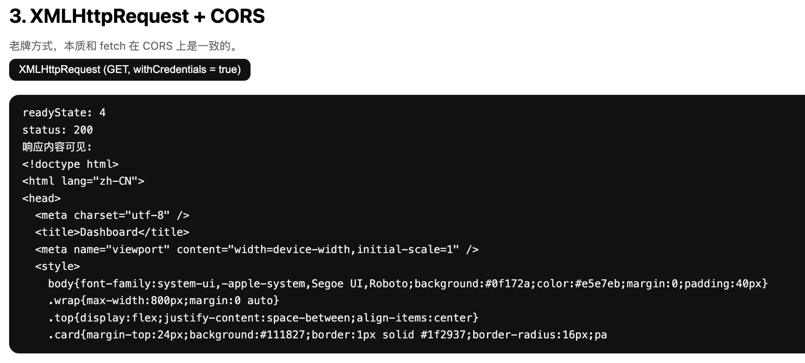

# 写在前面

这里大部分内容来自https://tech.meituan.com/2018/10/11/fe-security-csrf.html，写得特别好，膜拜~

一个典型的CSRF攻击有着如下的流程：

- 受害者登录a.com，并保留了登录凭证（Cookie）。
- 攻击者引诱受害者访问了b.com。
- b.com 向 a.com 发送了一个请求：a.com/act=xx。浏览器会默认携带a.com的Cookie。
- a.com接收到请求后，对请求进行验证，并确认是受害者的凭证，误以为是受害者自己发送的请求。
- a.com以受害者的名义执行了act=xx。
- 攻击完成，攻击者在受害者不知情的情况下，冒充受害者，让a.com执行了自己定义的操作。
<!--more-->

## demo说明

[https://github.com/Ak4izZ/CSRF-demo.git](https://github.com/Ak4izZ/CSRF-demo.git)

为了方便理解CSRF、同源策略与CORS，用AI写了一个demo，包含两个网站

- site-a是受攻击的网站，提供登录接口，登录后跳转到dashborad页面，可以看到敏感信息，运行在 `http://localhost:3000`
- site-b是用于测试跨域请求的恶意网站，运行在 `http://localhost:3001`

# 常见CSRF类型

下面列举一些前端常见的发起请求的方法，假设服务端的CORS设置得很宽松，响应头如下，我们可以尝试读取响应。

```jsx
Access-Control-Allow-Origin: http://localhost:3001
Access-Control-Allow-Methods: GET, POST, OPTIONS
Access-Control-Allow-Headers: *
Access-Control-Allow-Credentials: true
```

### XHR（XMLHttpRequest）型

经典、传统的方式

**GET**

```jsx
const xhr = new XMLHttpRequest();
xhr.open("GET", "/api/user");

// 尝试读数据
xhr.withCredentials = true; 
xhr.onload = () => console.log(xhr.responseText);

xhr.send();
```

**POST**

```jsx
const xhr = new XMLHttpRequest();
xhr.open("POST", "/api/login");

// 尝试读数据
xhr.withCredentials = true;
xhr.onload = () => console.log(xhr.responseText);

xhr.setRequestHeader("Content-Type", "application/json");
xhr.send(JSON.stringify({ username: "a", password: "b" }));
```

**OPTIONS**

浏览器自动发（预检请求），前端一般不会手动发，但你可以手动写

```jsx
xhr.open("OPTIONS", "/api");
xhr.send();
```



### ****

```jsx

```

在受害者访问含有这个img的页面后，浏览器会自动向`http://bank.example/withdraw?account=xiaoming&amount=10000&for=hacker`发出一次HTTP请求。bank.example就会收到包含受害者登录信息的一次跨域请求。

这只能发起get请求，浏览器只当成图像解码，***SOP 不允许我们访问“图片响应的原始文本”***


### Fetch

最常用的方式

```jsx
// get
fetch("https://a.com/api/data")
  .then(res => res.text())      // res.json() 也行
  .then(console.log);
  
  
// post
fetch("https://a.com/api/login", {
  method: "POST",
  headers: { "Content-Type": "application/json" },
  body: JSON.stringify({ user: "abc" })
}).then(res => res.json()).then(console.log);

// option
fetch("https://a.com/api", { method: "OPTIONS" })
  .then(r => r.text())
  .then(console.log);
```

fetch可以发送get、post请求，但如果访问需要会话凭证的页面，需要设置`credentials: 'include'` ，如下。

```jsx
fetch('http://localhost:3000/dashboard', {
            method: 'GET',
            mode: 'cors',
            credentials: 'include' // 如果是omit，或不设置该值，则不带cookie
          });
```


CORS策略全部放开时，不带cookie，被拦截，跳转到登录叶面


### `JSONP <script src=”xxx”>`

```jsx
<script src="https://a.com/jsonp?callback=cb"></script>
<script>
function cb(data) {
    console.log(data); // 能读
}
</script>
```

**JSONP = JSON with Padding**

它是一种「利用 `<script>` 标签天然允许跨域加载」的**跨域读取数据的黑科技（旧技术）**。

> JSONP 是服务端返回一段 JavaScript，而不是 JSON，让前端通过 `<script>` 标签执行这段 JS，并在里面主动把数据传出来。
> 

它是 **绕过同源策略读取跨域响应内容** 的最早技术之一。

因为浏览器有一个特殊规则：**`<script src="https://xxx.com/anything">` 永远允许跨域加载。**不受 SOP 限制，不需要 CORS。浏览器不会管脚本来自哪里，只要 MIME type 正确，它就会执行。JSONP 利用了这一点。

这种手法**需要受攻击的网站实现JSONP接口**，但目前已经基本淘汰。

```jsx
// 例如在 app.js 里
app.get('/jsonp', requireAuth, (req, res) => {
  const user = req.session.user.username;
  const callback = req.query.callback || 'callback';

  const payload = {
    user,
    secret: 'FLAG{THIS_IS_A_DEMO_SECRET}',
    hosts: ['10.0.0.5', '10.0.0.9']
  };

  res.setHeader('Content-Type', 'application/javascript; charset=utf-8');
  res.send(`${callback}(${JSON.stringify(payload)})`);
});
```

### `<script src=xxx>`

尽管不能读响应，但是还是可以发送get请求的

```jsx
    <section>
        <script src="http://localhost:3000/dashboard"></script>
    </section>
```

在b页面里嵌入上述的js代码，刷新页面后确实抓到了对于dashboard发起get请求的包，并且包含


### `<iframe>` + form提交

form+cookie是典型的手法

```jsx
<form action="https://bank.com/transfer" method="POST" target="hidden-frame">
  <input type="hidden" name="money" value="10000">
  <input type="hidden" name="to" value="attacker">
</form>
<iframe name="hidden-frame" style="display:none"></iframe>
<script>document.forms[0].submit()</script>
```

这个请求会自动携带 session cookie，但攻击者页面**永远不能读取响应 HTML**（SOP 限制），使用hidden-iframe是因为，**表单提交会导致页面跳转**（导航），攻击者不想让用户看见跳转，因此：

- 必须让表单的结果在一个 iframe 里面显示（用户不可见）
- 页面不离开攻击者站点（不会露馅）

是否能读取响应取决于 **是否同源**：

- 同源：能直接读 DOM
- 跨域但服务器 CORS 放开：❌ **仍然不能读 DOM**，因为这条请求走的是页面导航 / iframe 加载，而非CORS，SOP会拦截。


例外：iframe 内主动通过 postMessage 发给外层，但是你要有权限修改/dashboard页面的代码

```jsx
// iframe 内
window.parent.postMessage("data", "*");

// 外部
window.addEventListener("message", e => console.log(e.data));
```

### `<link>(css)`

```jsx
<link rel="stylesheet" href="https://localhost:3000/dashboard">
```

可以发送get请求，带凭据，跟img一样
SOP 限制：如果是样式能被浏览器使用，但 JS 不能读 raw text。

**`<video>/ <audio>`**

```jsx
<video src="https://localhost:3000/dashboard"></video>
```

可以发送get请求，带凭据，与img一样
只有媒体解码，不暴露 raw body。

### Service Worker

```jsx
self.addEventListener("fetch", e => {
  e.respondWith(
    fetch(e.request).then(r => r.text().then(body => {
      console.log(body);  // 能读
      return new Response(body);
    }))
  );
});
```

其实也是fetch

### websocket

浏览器不会把握手响应暴露给 JS。

不能读取握手响应 body，握手成功后通过 WebSocket 自己的协议通信

### sendBeacon

```jsx
navigator.sendBeacon("https://a.com/log", data);
```

能发送请求，不能读取响应
这是机制设计，不由 CORS 决定。

### CORS的影响

上述读取`/dashboard`响应的操作，需要同时满足两条CORS配置通过才能实现，否则只能发送请求，无法读取响应。

```jsx
Access-Control-Allow-Origin: http://localhost:3001
Access-Control-Allow-Credentials: true
```

# 如何防护CSRF

CSRF通常从第三方网站发起，被攻击的网站无法防止攻击发生，只能通过增强自己网站针对CSRF的防护能力来提升安全性。

前文讲了几个特点：

- CSRF（通常）发生在第三方域名。
- CSRF攻击者不能获取到Cookie等信息，只是使用。
- 前端js无法有几个无法修改的请求头：Origin，Referer等

针对这几点，可以制定如下防护策略

- **阻止不明外域的访问**
    - 同源检测
    - Samesite Cookie
- **提交时要求附加本域才能获取的信息**
    - CSRF Token
    - 双重Cookie验证

## 同源检测

在HTTP协议中，每一个异步请求都会携带两个Header，用于标记来源域名：

- Origin Header
- Referer Header


这两个Header在浏览器发起请求时，大多数情况会自动带上，并且不能由前端自定义内容。 服务器可以通过解析这两个Header中的域名，确定请求的来源域。

**Origin**

Origin在以下情况下并不存在:

- **IE11同源策略：** IE 11 不会在跨站CORS请求上添加Origin标头，Referer头将仍然是唯一的标识。最根本原因是因为IE 11对同源的定义和其他浏览器有不同，有两个主要的区别，可以参考[MDN Same-origin_policy#IE_Exceptions](https://developer.mozilla.org/en-US/docs/Web/Security/Same-origin_policy#IE_Exceptions)
- **302重定向：** 在302重定向之后Origin不包含在重定向的请求中，因为Origin可能会被认为是其他来源的敏感信息。对于302重定向的情况来说都是定向到新的服务器上的URL，因此浏览器不想将Origin泄漏到新的服务器上。
- **资源加载类请求：**如``，`<iframe>`等

**Referrer**

Referer 头更“脆弱”，很多情况都不带。
原因包括隐私、HTTPS 降 HTTP、Referrer-Policy 等。

```jsx
// 例如恶意页面可以设定Referrer-Policy 为no-referrer，这样从这里出去的请求头都不会带Referrer
app.use((req, res, next) => {
  res.header('Referrer-Policy', 'no-referrer');
  res.set('aaaaa', 'bbbbb');
  next();
});
```

因此，要检测同源，应当先检测Origin、再检测Referrer，当然单靠它不能完全阻止CSRF，还需要配合其他手段。

## SamesiteCookie

**SameSite**是Cookie的一个属性，用来控制浏览器在跨站请求中是否携带这个Cookie，它是浏览器抵御CSRF的核心机制。

目前浏览器支持

| **模式** | **是否允许跨站请求带 Cookie** | **场景** |
| --- | --- | --- |
| **Strict** | ❌ 完全禁止 | 最安全，不适合需要跨站跳转后保持登录的系统 |
| **Lax（默认）** | ✔ 某些“导航型 GET”允许 | 目前浏览器的默认值（未声明 SameSite 时） |
| **None** | ✔ 所有跨站请求都带 | 但是必须配合 Secure（HTTPS） |

关于这个配置

我手动测试了一下，a.com的配置为

```jsx
Cookie: Path=/; HttpOnly; SameSite=Strict，

Access-Control-Allow-Origin：http://localhost:3001  // 即b.com
Access-Control-Allow-Headers：Content-Type
Access-Control-Allow-Credentials：true
Access-Control-Allow-Methods：GET, POST, OPTIONS（固定）
```

b.com使用fetch主动发起跨站请求，并尝试读取响应

```jsx
        <script>
            document.getElementById('btn-fetch-cred').onclick = async () => {
                const outId = 'out-fetch-cred';
                log(outId, '发起请求…');
                try {
                    const resp = await fetch('http://localhost:3000/dashboard', {
                        method: 'GET',
                        mode: 'cors',
                        credentials: 'include' // 尝试带 cookie
                    });
                    const text = await resp.text();
                    log(outId, `状态: ${resp.status}
CORS 可见: 是
响应长度: ${text.length}
前 500 字符:
${text.slice(0, 500)}`);
                } catch (e) {
                    log(outId, `请求失败: ${e}
多半是 CORS / Same-Origin Policy 拦截导致无法读取响应。`);
                }
            };
        </script>
```

这种情况下，可以成功实现CSRF。Claude的解释为：`localhost:3000`与`localhost:3001`被认为是Same-Site，因此不会被拦截。


Same-Site vs Same-Origin 的区别

1. **Same-Origin（同源）**：协议 + 域名 + 端口必须完全相同
    - `http://localhost:3000` 和 `http://localhost:3001` 是**跨源**的
2. **Same-Site（同站）**：基于 **eTLD+1**（有效顶级域名+1）判定
    - `http://localhost:3000` 和 `http://localhost:3001` 是**同站**的
    - 端口号在 SameSite 判定中**被忽略**

果然，当我通过`http://127.0.0.1:3001`访问b.com时，虽然可以发起跨站请求，也可以获取响应，但是无法携带Cookie


## CSRF Token

**服务端在session里记一个随机Token**

```jsx
const crypto = require('crypto');

function ensureCsrfToken(req) {
  if (!req.session.csrfToken) {
    req.session.csrfToken = crypto.randomBytes(32).toString('hex');
  }
  return req.session.csrfToken;
}
```

**渲染页面时注入Token**

两种注入方式：

- `<input type="hidden" name="_csrf">`：表单自动带上
- `<meta name="csrf-token">`：前端 JS 可以从 DOM 里读出来，用在 AJAX 请求里

**从该页面提交的请求携带这个token**

前端脚本从 `<meta>` 里把 token 读出来，加在 header 或 body 里：

```jsx
<meta name="csrf-token" content="...">
<script>
  function getCsrfToken() {
    return document
      .querySelector('meta[name="csrf-token"]')
      .getAttribute('content');
  }

  async function saveSettings() {
    const token = getCsrfToken();
    const resp = await fetch('/settings', {
      method: 'POST',
      headers: {
        'Content-Type': 'application/json',
        // 推荐放自定义 header 里：
        'X-CSRF-Token': token
      },
      body: JSON.stringify({ nickname: 'kaz' }),
      credentials: 'include'
    });
    console.log(await resp.text());
  }
</script>    
```

- Token 存在 HTML / JS 里
- 由于SOP，攻击者在 b.com 的 JS 无法读 a.com DOM，自然无法拿到 token
- 但 a.com 自己前端代码可以读到并塞进请求里

**服务器验证token是否正确**

```jsx
function verifyCsrf(req, res, next) {
  // 1. 从请求里拿 token（可能在 body / header / query）
  const tokenFromBody = req.body && req.body._csrf;
  const tokenFromHeader = req.get('X-CSRF-Token');
  const token = tokenFromBody || tokenFromHeader;

  if (!token) {
    return res.status(403).send('CSRF token missing');
  }

  // 2. 从 session 里拿“正确答案”
  const expected = req.session.csrfToken;
  if (!expected) {
    return res.status(403).send('CSRF token not initialized');
  }

  // 3. 对比（实际可用 constant-time 比较防侧信道）
  if (token !== expected) {
    return res.status(403).send('Invalid CSRF token');
  }

  // 验证通过，继续
  return next();
}
```

### 分布式校验

传统方案将 CSRF Token 存在 Session 中。
在单机环境可行，但在大型分布式系统中，用户请求会落到不同服务器节点，而 Session 默认存储在本地内存，导致后续请求无法读取之前的 Token，使验证失败。
因此分布式系统必须使用 Redis 等共享存储来保存 Session，否则 Session 机制会失效。

为避免依赖 Redis，许多大型网站采用 **Stateless CSRF Token（Encrypted Token Pattern）**。

这种 Token 不是随机字符串，而是基于：

```java
userId + timestamp + nonce + HMAC(secret, userId + timestamp + sessionId)
```

生成的有签名的 Token。
服务器验证时仅需重新计算 HMAC 并校验时间，无需存储 Token，也不存在节点不一致的问题。

## 双重Cookie验证  **double submit cookie**

在会话中存储CSRF Token比较繁琐，而且不能在通用的拦截上统一处理所有的接口。

那么另一种防御措施是使用双重提交Cookie。利用CSRF攻击不能获取到用户Cookie的特点，我们可以要求Ajax和表单请求携带一个Cookie中的值（这意味着这种方案**一定不能用http-only**，因为它会阻止JS读取Cookie内容）。

大致流程：

1. 服务器下发一个 `csrf_token=xxxx` 的 Cookie（SameSite=None / Lax）
2. 前端从 Cookie 里读取这个 token，放到 header/body ← a.com JS 能读，b.com JS 读不到（SOP）
3. 服务器对比：
    - Cookie 中的 csrf_token
    - 请求 body/header 中的 csrf_token
        
        一致则通过
        

好处：

- 无需使用Session，适用面更广，易于实施。
- Token储存于客户端中，不会给服务器带来压力。
- 相对于Token，实施成本更低，可以在前后端统一拦截校验，而不需要一个个接口和页面添加。

坏处：

- Cookie中增加了额外的字段。
- 如果有其他漏洞（例如XSS），攻击者可以注入Cookie，那么该防御方式失效。
- 难以做到子域名的隔离。
- 为了确保Cookie传输安全，采用这种防御方式的最好确保用整站HTTPS的方式，如果还没切HTTPS的使用这种方式也会有风险。

# 总结

CSRF 的本质：浏览器会在跨站请求中自动附带凭证（Cookie / Session），
而受害站点在没有额外校验的情况下，仅凭 Cookie 就相信“这是用户本人发起的请求”。

典型 CSRF 条件：

- 受害者已在 [a.com](http://a.com/) 登录，浏览器持有有效 Cookie；
- 受害者访问了第三方站点 [b.com](http://b.com/)；
- [b.com](http://b.com/) 通过 `` / `<form>` / `fetch` 等方式向 [a.com](http://a.com/) 发起请求；
- 浏览器自动带上 [a.com](http://a.com/) 的 Cookie；
- [a.com](http://a.com/) 未进行来源校验或 CSRF Token 校验，直接执行敏感操作。

防护思路可以分为两大类：

1. **减少“第三方请求 + 自动携带 Cookie”的机会**
    - SameSite Cookie：限制 Cookie 在跨站请求中是否发送（Strict / Lax / None）。
    - 合理的 Cookie 作用域：敏感 Cookie 只用于必要站点，不滥用跨子域 Cookie。
    - 避免用 GET 修改状态（Lax 仍允许跨站导航 GET 带 Cookie）。
2. **即使请求带了 Cookie，也要判断“是不是从自己页面发出的”**
    - **同源检测**：优先校验 `Origin`，必要时回退到 `Referer`。
    - **CSRF Token**：
        - 会话型（Session 存储）：简单直观，但分布式需 Redis 等共享存储。
        - 无状态型（Stateless / HMAC）：用 `userId + timestamp + nonce + HMAC(secret, ...)` 生成 Token，无需存储，只需验签 + 校验时间。
    - **双重提交 Cookie（Double Submit Cookie）**：
        - 前端从非 HttpOnly 的 `csrf_token` Cookie 读出值，放到 header/body；
        - 服务端对比 Cookie 与 header/body 中的值；
        - 不依赖服务器存储，但在存在 XSS 时会失效。

实战中，应组合多种手段：

- 表单 / 修改状态接口：强制使用 POST + CSRF Token 校验；
- 全站 Cookie：默认使用 `SameSite=Lax` 或 `Strict`，只有必须跨站的 Cookie 才设置 `SameSite=None; Secure`；
- 所有敏感操作：校验 Origin / Referer，拒绝明显的第三方来源；
- 避免使用 GET 做任何有副作用的操作。

CSRF 的防护永远不是某一个开关，而是一组策略叠加：

**SameSite 减少自动带 Cookie 的机会，Origin/Referer 和 CSRF Token 判定请求来源是否可信，Double Submit Cookie 在无 Session/分布式场景下提供兼容方案。**